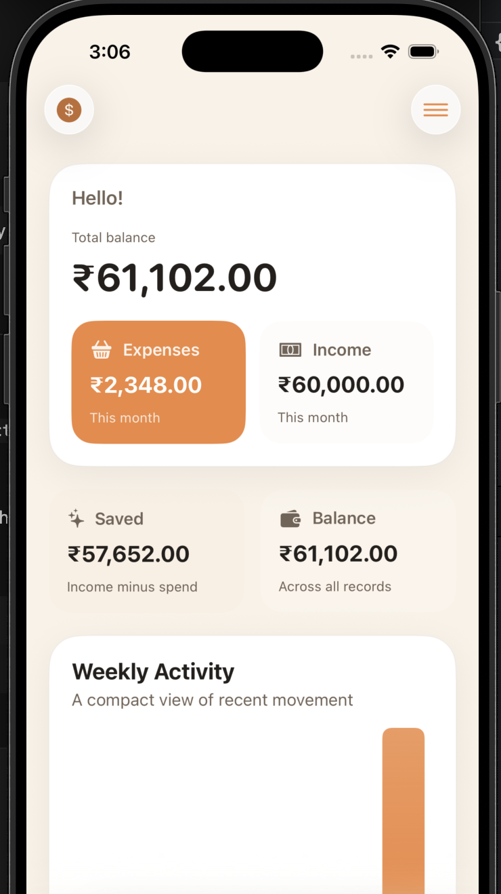
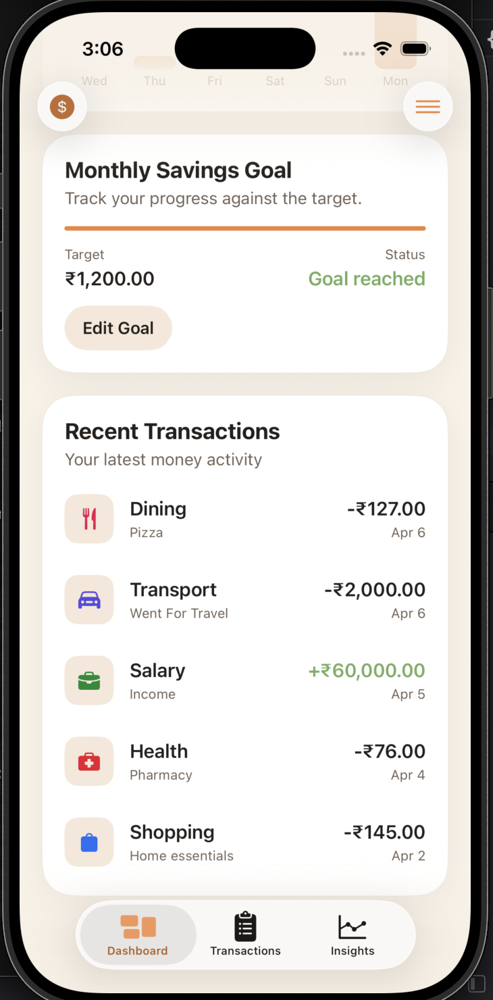
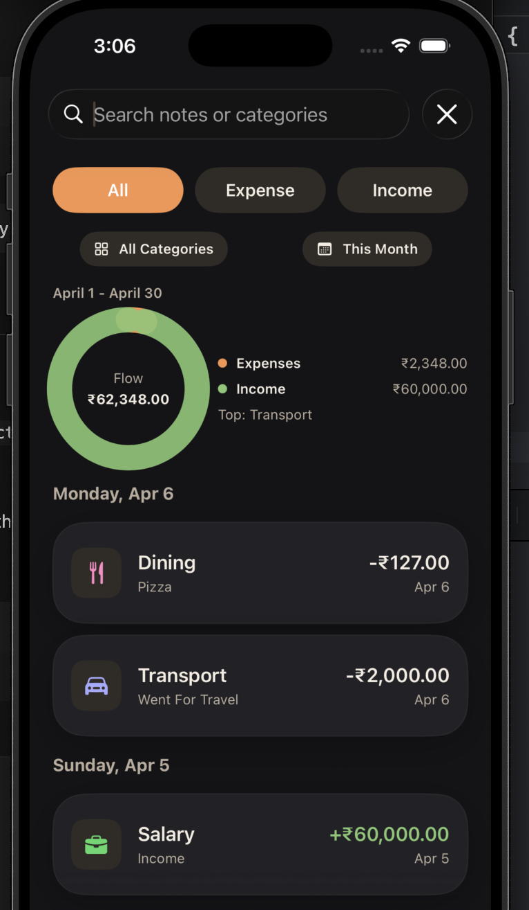
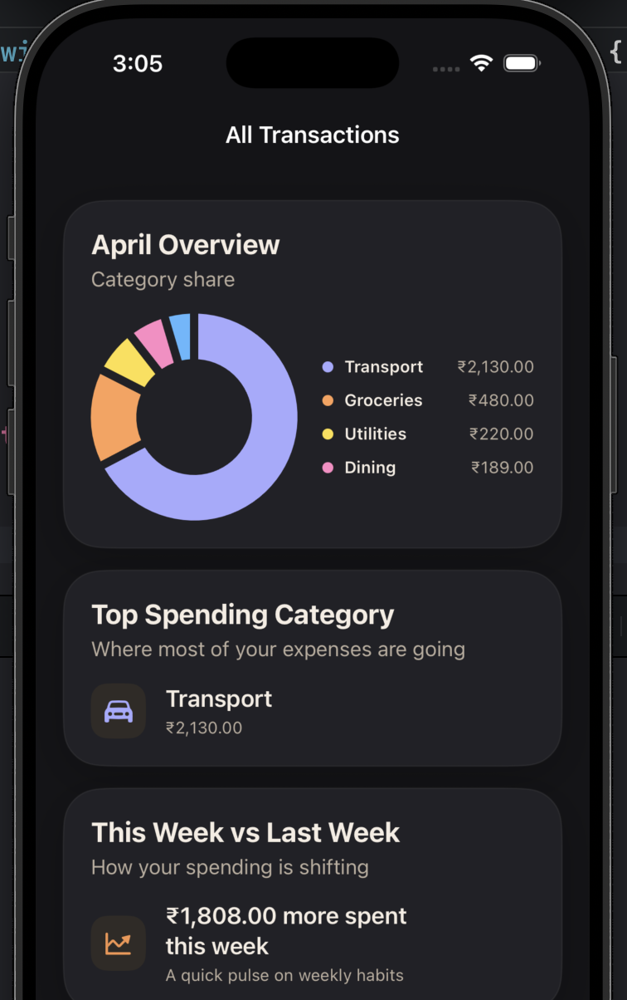
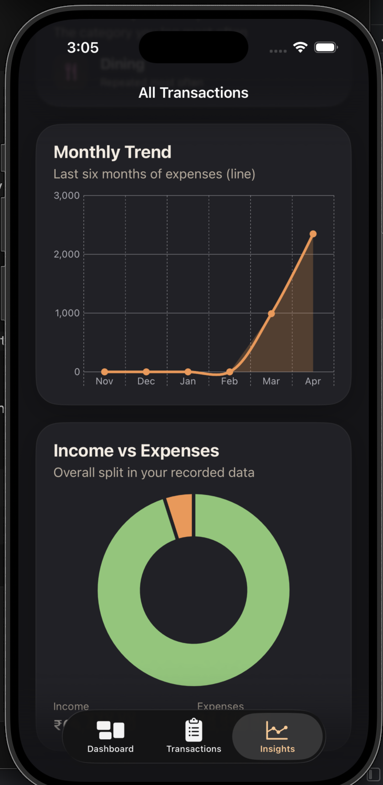
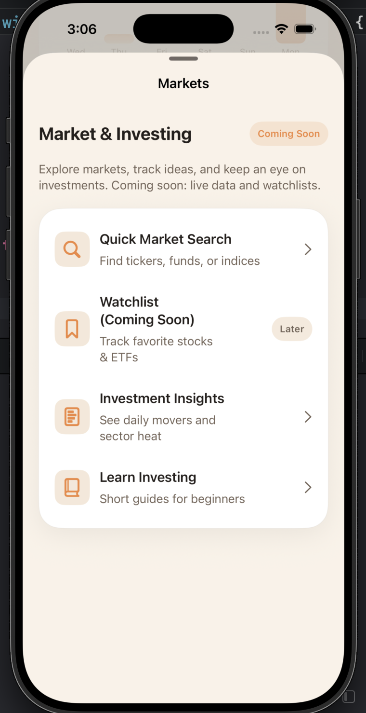
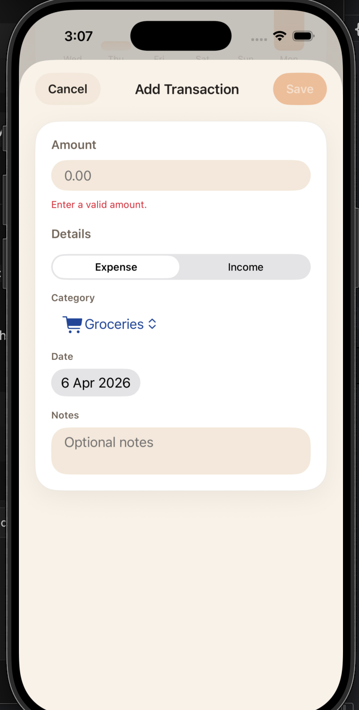

# FinanceHelper

FinanceHelper is a native iOS personal finance companion built with SwiftUI and SwiftData. It focuses on calm, mobile-first money tracking with a dashboard, transaction history, monthly savings goals, and lightweight insights.

## Features

- Dashboard with current balance, this-month income and expenses, savings goal progress, and recent activity
- Transaction management with add, edit, delete, search, and filters
- Monthly savings goal flow integrated into the dashboard
- Insights screen with top category, weekly comparison, monthly trend, and income-versus-expense split
- Local-first persistence with clear empty states on first launch

## Tech Stack

- SwiftUI for the interface
- SwiftData for local persistence
- Charts for compact visual summaries
- Observation-friendly view state with focused services and calculators

## Project Structure

- `FinanceHelper/App`: app entry and root navigation
- `FinanceHelper/Features`: dashboard, transactions, insights, and goals
- `FinanceHelper/Shared/Models`: SwiftData models and shared value types
- `FinanceHelper/Shared/Services`: repository, calculations, validation, first-launch setup
- `FinanceHelper/Shared/UI`: reusable card, list row, and empty state components

## Assumptions

- Single-user, local-only app with no account system or bank integration
- Current balance is calculated from recorded transactions
- One active monthly savings goal at a time
- English-only interface for this assignment

## Setup

1. Open `FinanceHelper.xcodeproj` in Xcode.
2. Ensure the active developer directory points to full Xcode if command-line builds are needed.
3. Run the `FinanceHelper` scheme on an iPhone simulator.

## Notes

- The app starts from a true zero state so the evaluator can see empty-state UX and enter data manually.
- The architecture keeps calculation logic out of views to make unit testing straightforward.
- A 2s splash/onboarding screen eases into the main app (`Shared/UI/SplashView.swift`).
- Loading and error placeholders are available for dashboard, transactions, and insights (`Shared/UI/LoadStateViews.swift`).

## Screenshots

| Dashboard | Dashboard (Goal/Recent) |
| --- | --- |
|  |  |

| Transactions | Insights |
| --- | --- |
|  |  |

| Insights Trend | Markets | Add Transaction |
| --- | --- | --- |
|  |  |  |

## Feature Checklist (with file references)

- Home Dashboard with Summary: `FinanceHelper/Features/Dashboard/DashboardView.swift`
- Visual Elements (charts/trends/breakdowns): bar and donut charts in dashboard; line/area and split charts in `Features/Insights/InsightsView.swift`
- Transaction Tracking (add/view/edit/delete): list + swipe actions + form in `Features/Transactions/TransactionsView.swift` and `Features/Transactions/TransactionFormView.swift`
- Transaction Filtering/Search: search bar and type/category/date chips in `Features/Transactions/TransactionsView.swift`
- Goal/Challenge Feature: monthly savings goal and progress in `Features/Dashboard/DashboardView.swift` and `Features/Goals/SavingsGoalEditorView.swift`
- Insights Screen: top category, weekly delta, monthly trend, income/expense split, category donut in `Features/Insights/InsightsView.swift`
- Smooth Navigation Flow: tab bar shell `App/AppRootView.swift`, sheets for add/edit/market/goal
- Empty/Loading/Error States: `Shared/UI/EmptyStateView.swift`, `Shared/UI/LoadStateViews.swift` used across dashboard, insights, transactions
- Local Data Persistence: SwiftData models `Shared/Models/TransactionRecord.swift`, `Shared/Models/SavingsGoal.swift`
- State Management: SwiftUI state + SwiftData queries + repository/calculators (`Shared/Services`)
